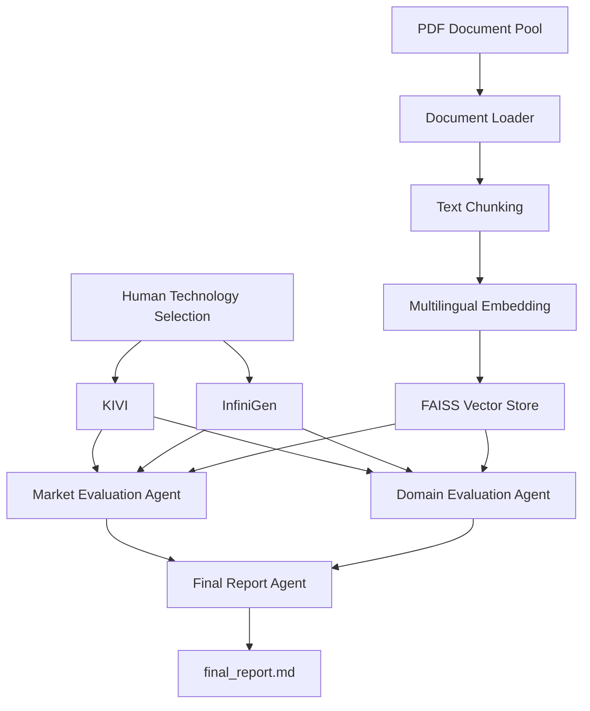

# KV Cache Multi-Agent Evaluation with Agentic RAG

## Subject

본 프로젝트는 KV cache 최적화 기술을 소프트웨어와 하드웨어/시스템 진영에서 각각 선정하고, 시장성 및 데이터센터·클라우드 LLM 서빙 도메인 관점에서 평가하는 Agentic RAG 프로젝트이다.

Doc Pool에서 소프트웨어 기술로 KIVI, 하드웨어/시스템 기술로 InfiniGen을 사람이 직접 선정하였다. 기술 선정은 Agent가 수행하지 않으며, 각 Agent는 선정된 기술을 서로 다른 관점에서 분석한다.

## Overview

- Objective: 하나의 KV cache 최적화 기술을 복수 관점에서 분석하고 기술별 trade-off를 비교
- Method: Multi-Agent 기반 LangGraph 워크플로 + Retrieval-Augmented Generation
- Selection Method: Human-based
- Target Domain: 데이터센터 및 클라우드 기반 long-context LLM serving
- Tools: LangGraph, LangChain, FAISS

## Selected Technologies

- SW: KIVI
  - 2-bit 비대칭 양자화를 이용해 KV cache의 메모리 사용량을 줄이는 소프트웨어 기반 기술
  - 기존 GPU 기반 LLM 추론 환경에서의 메모리 효율성과 장문맥 확장성을 평가하기 위해 선정

- HW/System: InfiniGen
  - CPU–GPU 메모리 계층과 선택적 KV cache prefetch를 활용하는 시스템 기반 기술
  - GPU HBM 사용량, 데이터 이동 및 장문맥 LLM 서빙 성능을 평가하기 위해 선정

## RAG Documents

Doc Pool에서 각 진영별 원 논문을 한 편씩 직접 선정하였다.

| Technology | Document | Role |
|---|---|---|
| KIVI | KIVI: A Tuning-Free Asymmetric 2bit Quantization for KV Cache | SW 진영 원 논문 |
| InfiniGen | InfiniGen: Efficient Generative Inference of Large Language Models with Dynamic KV Cache Management | HW/System 진영 원 논문 |

## Features

- KIVI 및 InfiniGen PDF 원문 기반 정보 추출
- PDF 페이지 단위 metadata 관리
- 문서 chunk 분할 및 FAISS 벡터 인덱싱
- 기술별 metadata filtering을 적용한 검색
- 시장성 및 도메인 적용성 관점의 독립 분석
- LangGraph를 이용한 Multi-Agent 워크플로 구성
- 검색 근거를 기반으로 한 한국어 비교 평가 보고서 생성
- API 동시 요청 제한을 고려한 순차 Agent 실행
- API 없이 검색 및 그래프 구조를 검사하는 offline smoke test 지원

## Confirmation Bias Mitigation

확증 편향을 줄이기 위해 다음 전략을 적용하였다.

- 기술 선정과 기술 평가를 분리하고 선정은 사람이 직접 수행
- Agent가 기술을 재선정하거나 우승 기술을 결정하지 못하도록 프롬프트에서 제한
- KIVI와 InfiniGen에 동일한 평가 기준 적용
- 시장성 평가와 도메인 평가를 별도 Agent로 분리
- 검색된 논문 근거만 사용하도록 Agent 프롬프트 제한
- 근거가 부족한 내용은 `Insufficient evidence` 또는 한계로 명시
- 사실과 시장적 해석을 구분하도록 프롬프트 구성
- Final Report Agent가 특정 기술을 추천하거나 승자를 결정하지 않도록 제한
- 최종 보고서에 RAG 검색 및 상용화 자료의 한계를 명시

## Tech Stack

- Language: Python 3.11
- Workflow Framework: LangGraph
- RAG Framework: LangChain
- LLM/Generator: gpt-4o-mini
- LLM/Judge: gpt-4o-mini 기반 Final Report Agent
- Vector Database: FAISS
- Retrieval Metric: Hit Rate@4 = 1.000
- MRR: 미측정
- Embedding: Alibaba-NLP/gte-multilingual-base
- PDF Loader: PyPDFLoader

## Agents

### Market Evaluation Agent

다음 기준으로 두 기술의 시장 적용 가능성을 평가한다.

- 기존 GPU 및 소프트웨어 인프라 호환성
- 도입 복잡도
- 추가 하드웨어 또는 시스템 변경 필요성
- 운영 및 인프라 비용
- 상용 LLM 서빙 확장성
- 상용화 및 채택 장벽

### Domain Evaluation Agent

데이터센터 및 클라우드 기반 long-context LLM serving 관점에서 평가한다.

- GPU HBM 메모리 효율
- Throughput 및 latency
- 장문맥 확장성
- 정확도 및 모델 품질 영향
- CPU–GPU 데이터 이동
- 다중 사용자 및 batch serving 적용성
- 인프라 변경 요구사항

### Final Report Agent

Market Agent와 Domain Agent의 결과를 통합해 중립적인 한국어 비교 보고서를 생성한다.

- 특정 기술의 우위를 결정하지 않음
- 사실과 해석을 구분
- 관점별 trade-off를 설명
- 증거가 부족한 부분과 분석의 한계를 명시
- 기술 선정 방식이 Human-based임을 명시

## Architecture



LangGraph에서는 Market Agent와 Domain Agent가 독립된 노드로 구성되며, 두 분석 결과가 Final Report Agent로 병합된다. 회사 API의 동시 요청 제한을 고려해 실행 시 `max_concurrency=1`을 적용하였다.

## Directory Structure

```text
├── agents/
│   ├── llm.py
│   ├── market_agent.py
│   ├── domain_agent.py
│   └── report_agent.py
├── data/
│   ├── raw/
│   │   ├── kivi.pdf
│   │   └── infinigen.pdf
│   └── vectorstore/
├── evaluation/
│   ├── retrieval_eval.py
│   └── test_queries.json
├── graph/
│   ├── nodes.py
│   ├── state.py
│   └── workflow.py
├── prompts/
├── rag/
│   ├── loader.py
│   ├── chunker.py
│   ├── embeddings.py
│   ├── vectorstore.py
│   └── retriever.py
├── scripts/
│   ├── check_environment.py
│   └── offline_smoke.py
├── outputs/
│   └── final_report.md
├── app.py
├── requirements.txt
└── README.md
```

## Installation

```bash
cd /Users/seung/kv-cache-agentic-rag

python3.11 -m venv .venv
source .venv/bin/activate

python -m pip install --upgrade pip
python -m pip install -r requirements.txt
```

프로젝트 루트에 `.env` 파일을 생성한다.

```dotenv
OPENAI_API_KEY=your_api_key
OPENAI_MODEL=gpt-4o-mini
```

`.env` 파일은 Git에 포함하지 않는다.

## Usage

환경 검사:

```bash
python scripts/check_environment.py
```

RAG 검색 평가:

```bash
python -m evaluation.retrieval_eval
```

API 없이 로컬 구조 검사:

```bash
python scripts/offline_smoke.py
```

전체 Agentic RAG 실행:

```bash
python app.py
```

최종 보고서는 다음 경로에 저장된다.

```text
outputs/final_report.md
```

## Evaluation Result

- Retrieval Test Cases: 6
- Passed: 6/6
- Hit Rate@4: 1.000
- Environment Check: PASS
- Offline LangGraph Smoke Test: PASS
- Full Agentic RAG Workflow: PASS
- Final Report Generation: PASS

## Limitations

- 분석 자료가 KIVI와 InfiniGen 원 논문에 한정되어 있음
- 실제 상용 서비스 적용 사례에 대한 근거가 제한적임
- 시장성 분석에는 기술적 근거를 기반으로 한 추론이 포함될 수 있음
- Hit Rate는 측정했지만 MRR 등의 순위 기반 검색 지표는 측정하지 않음
- 동일한 LLM이 개별 분석과 최종 보고서 생성에 사용됨
- 회사 API의 모델 및 동시 요청 권한에 영향을 받음

## Contributors

- 개인과제